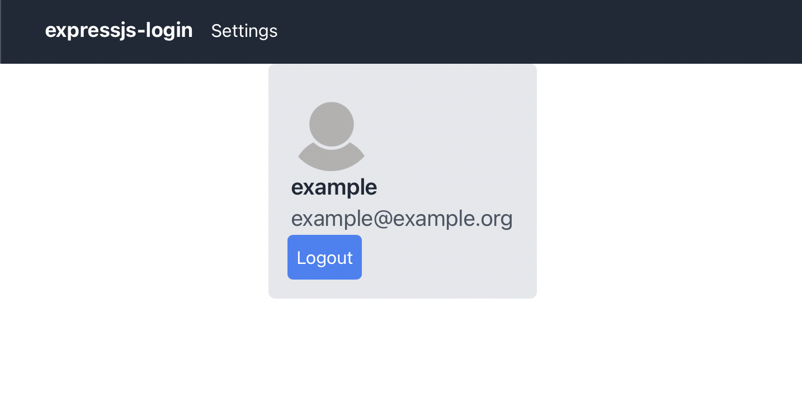

# react-login



This project is a simple web application built with React for the frontend and Express for the backend, providing user authentication and profile information retrieval. The backend utilizes JSON Web Tokens (JWT) for session handling, and MySQL is used as the database to store user account information.

## Getting started
1. **Clone the repository:**

    ```bash
    git clone https://github.com/schererleander/react-login.git
    cd react-login
    ```

2. **Install dependencies for both frontend and backend:**

    ```bash
    cd frontend
    npm install
    cd ../backend
    npm install
    ```

3. **Set up your MySQL database and update the connection configuration in `server.js`.**

4. **Start the backend server:**

    ```bash
    cd backend
    node server.js
    ```

5. **Start the React app:**

    ```bash
    cd frontend
    npm start
    ```


## Warning:

This project is for development purposes only and has certain security considerations:

- **Password Storage:** Passwords are stored as plain text in the database.
- **HTTPS:** For development reasons, this project does not use HTTPS.
- **Token:** Toke is saved as a cookie.

## References:

[Use tailwindcss in react app](https://tailwindcss.com/docs/guides/create-react-app)

[ExpressJS Getting started](https://expressjs.com/en/starter/hello-world.html)

[ExpressJS Basich routing](https://expressjs.com/en/starter/basic-routing.html)

[express-session](https://expressjs.com/en/resources/middleware/session.html)